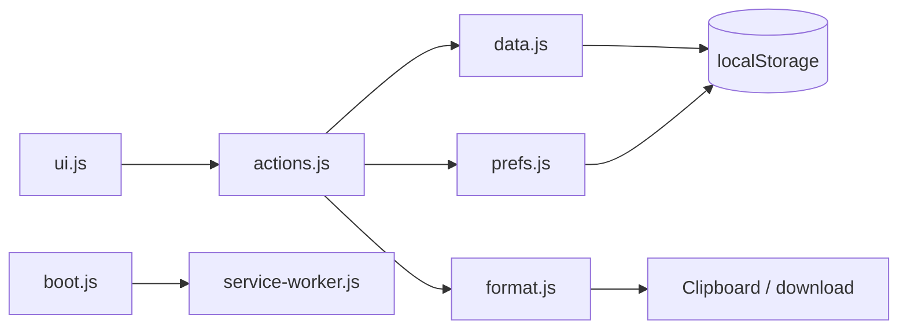

# Architecture — IT Support Field Notes

## Overview

FieldNotes is a **static single-page application**: HTML shell, CSS theme, and vanilla JavaScript modules. There is **no build step**, **no backend**, and **no npm dependencies**. It deploys to Vercel (or any static host) as plain files from the repo root.

```
Browser
  └── index.html
        ├── constants.js   (enums, schema version, sort options)
        ├── prefs.js       (UI preferences localStorage)
        ├── templates.js   (12 incident templates)
        ├── data.js        (CRUD, migration, query, import)
        ├── format.js      (escape, copy formats, CSV, combined TXT)
        ├── ui.js          (views, filters, modals, toasts)
        ├── actions.js     (events, copy, export, import, voice)
        └── boot.js        (init, theme, service worker)
```

---

## File roles

| File | Role |
|------|------|
| `index.html` | Entry page, script load order, manifest link |
| `constants.js` | Contexts, statuses, priorities, categories, `SCHEMA_VERSION` (4), storage keys |
| `prefs.js` | `fieldnotes_ui_prefs_v1`: filters, sort, `privacyMode`, `theme` |
| `templates.js` | Template definitions for new-incident form |
| `data.js` | Load/save, normalize, migrate, `query()`, pin/archive, `importNotes()` |
| `format.js` | Ticket text variants, badges, CSV, combined TXT |
| `ui.js` | List/form/detail, filter panel, data tools, modals |
| `actions.js` | Handlers: templates, snippets, copy formats, import |
| `boot.js` | DOM ready, theme from prefs, SW register (non-localhost) |
| `styles.css` | Layout, dark mode CSS variables, a11y focus |
| `service-worker.js` | Shell cache `fieldnotes-shell-v4` |
| `manifest.webmanifest` | PWA metadata |

---

## Data flow

```
User action (actions.js)
    → FieldNotesData.create/update/remove/query/import
        → normalizeNote() on read/write
        → localStorage.setItem('fieldnotes_incidents_v2', JSON)
    → FieldNotesPrefs.save() for filter/sort/theme/privacy
    → FieldNotesUI.render*
```

Copy/export:

```
Detail → Copy (full | short | escalation | manager | learning)
    → FieldNotesFormat.format*()
    → clipboard or fallback modal

Data tools → export JSON | CSV | combined TXT | import JSON
```

List filtering:

```
FieldNotesPrefs.load() + search input
    → FieldNotesData.query(search, filters, sort)
    → pinned first, then sort key
```

---

## localStorage keys

| Key | Purpose |
|-----|---------|
| `fieldnotes_incidents_v2` | Active incident notes (schema v4 inside each note) |
| `fieldnotes_ui_prefs_v1` | Filters, sort, privacy mode, theme |
| `fieldnotes_notes_v1` | Legacy generic notes; migrated once if v2 empty; **not deleted** |

---

## Schema versioning

- **Schema version 4** (current): adds `pinned`, `archived`, optional `templateUsed`.
- Storage key remains `fieldnotes_incidents_v2`.
- On load, every note passes through `normalizeNote()` with defaults.
- `noteNeedsUpgrade()` inspects **parsed stored JSON** before normalization. If any raw note lacks required fields or `schemaVersion < 4`, the upgraded array is persisted.

### v1 → v2

Legacy notes (`title`, `body`, `location`) convert to structured fields.

### v2 → v3

Adds status, priority, category, resolution summary, time spent, escalated to.

### v3 → v4

Adds `pinned: false`, `archived: false`, optional `templateUsed`.

---

## Import / export

**Export JSON:** `{ schemaVersion, exportedAt, notes: [...] }` — same shape import expects.

**Import modes:**
- **Merge:** New IDs for conflicts; duplicate IDs keep note with newer `updatedAt` or assign new id.
- **Replace:** Validates JSON first; only then replaces all notes.

**CSV / combined TXT:** Generated from normalized notes via `format.js`; no separate storage.

---

## No-backend rationale

- Zero hosting cost on Vercel
- No API keys in repo
- Data stays on device unless user exports
- Beginner-maintainable: edit files, refresh

Trade-off: no sync; manual backup required.

---

## Diagram


