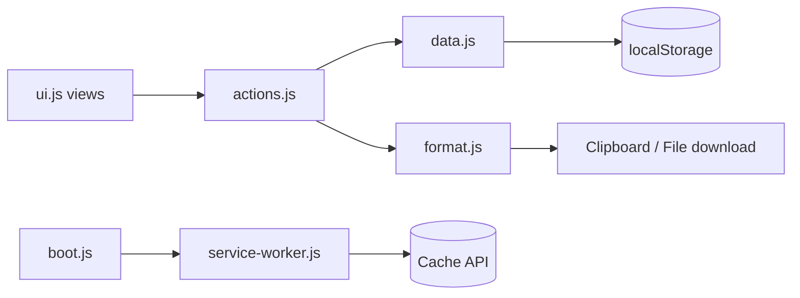

# Architecture — IT Support Field Notes

## Overview

FieldNotes is a **static single-page application**: HTML shell, CSS theme, and vanilla JavaScript modules. There is **no build step**, **no backend**, and **no npm dependencies**. It deploys to Vercel (or any static host) as plain files from the repo root.

```
Browser
  └── index.html
        ├── constants.js   (enums, schema version)
        ├── data.js        (localStorage CRUD + migration)
        ├── format.js      (HTML escape, ticket text, badges)
        ├── ui.js          (render views, toasts, modals)
        ├── actions.js     (events, copy, export, voice)
        └── boot.js          (init, service worker register)
```

---

## File roles

| File | Role |
|------|------|
| `index.html` | Entry page, script load order, manifest link |
| `constants.js` | Shared constants: contexts, statuses, priorities, categories, schema version |
| `data.js` | Load/save notes, normalize schema, search, export payload, clear data |
| `format.js` | Formatting for UI and clipboard/export |
| `ui.js` | HTML templates for list, form, detail, modals, toasts |
| `actions.js` | Click/submit handlers, routing between views |
| `boot.js` | DOM ready init; register service worker (non-localhost) |
| `styles.css` | Layout, badges, modals, toasts |
| `service-worker.js` | Cache static shell for offline load |
| `manifest.webmanifest` | PWA metadata |

---

## Data flow

```
User action (actions.js)
    → FieldNotesData.create/update/remove/search
        → normalizeNote() on read/write
        → localStorage.setItem('fieldnotes_incidents_v2', JSON)
    → FieldNotesUI.render*
        → innerHTML into #app
```

Copy/export:

```
Detail → Copy / Export
    → FieldNotesFormat.formatTicketText(note)
    → clipboard API or Blob download
```

Voice:

```
Dictate click → SpeechRecognition (browser)
    → append transcript to textarea (actions.js)
```

PWA:

```
boot.js → navigator.serviceWorker.register (production host only)
service-worker.js → cache shell assets on install
fetch → cache-first with network update
```

---

## localStorage keys

| Key | Purpose |
|-----|---------|
| `fieldnotes_incidents_v2` | Active incident notes (schema v3 inside array) |
| `fieldnotes_notes_v1` | Legacy generic notes; migrated once if v2 empty; **not deleted** |

---

## Schema versioning

- **Schema version 3** (current): adds `status`, `priority`, `category`, `resolutionSummary`, `timeSpent`, `escalatedTo`.
- Storage key remains `fieldnotes_incidents_v2` to avoid breaking existing installs.
- On load, every note passes through `normalizeNote()` with defaults.
- If stored notes lack v3 fields, they are upgraded in memory and re-saved.

### v1 → v2 migration

Legacy notes (`title`, `body`, `location`) convert to structured fields; `body` → `issue`, `location` → `reference` when both exist.

### v2 → v3 upgrade

In-place: existing v2 incidents gain default status/priority/category. Status may infer from `result` text (e.g. “resolved” → Resolved).

---

## No-backend rationale

- Zero hosting cost and complexity on Vercel
- No API keys or secrets in repo
- Suitable for sensitive environments where data must not leave the device
- Beginner-maintainable: open files, edit, refresh

Trade-off: no sync, no multi-device backup without manual export.

---

## How data flows (diagram)


